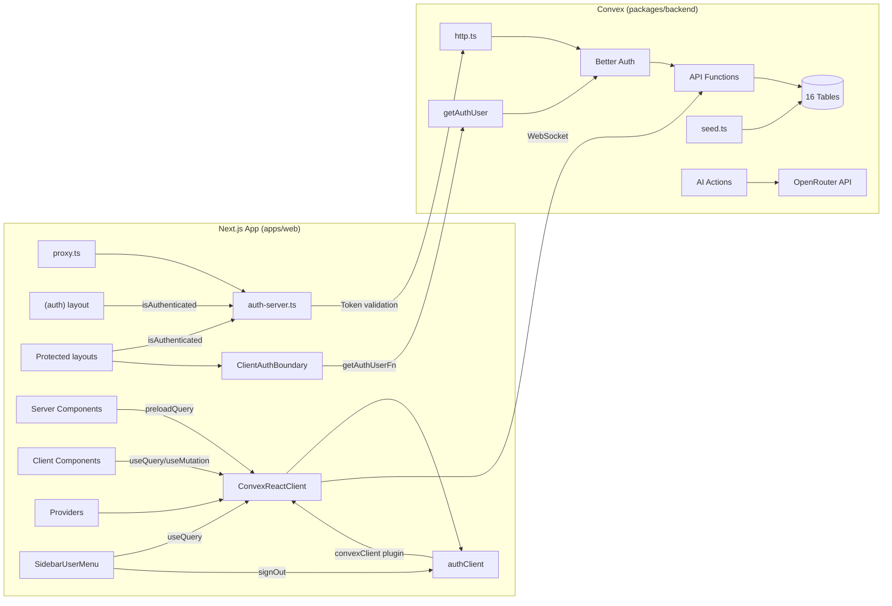

# Connect Aqoon AI Frontend to Convex Backend

Replace all mock `useState` data across 25+ pages with live Convex queries/mutations, add route protection via proxy, seed the database, and integrate AI features via OpenRouter.

---

## Changelog (Latest Session — Feb 26, 2026)

### Phase 8: OpenRouter AI Integration ✅

| Change                     | File                                                 | Detail                                                                                                                                        |
| -------------------------- | ---------------------------------------------------- | --------------------------------------------------------------------------------------------------------------------------------------------- |
| **[NEW] AI actions**       | `packages/backend/convex/ai.ts`                      | `generateStudyPlan` + `assessSkills` Convex actions using `generateText()` + `Output.object()` (AI SDK v6) with `@openrouter/ai-sdk-provider` |
| **Study plan wired**       | `apps/web/src/app/student/study-plan/page.tsx`       | Replaced mock `setTimeout` with `useAction(api.ai.generateStudyPlan)`                                                                         |
| **Skill assessment wired** | `apps/web/src/app/student/skill-assessment/page.tsx` | Replaced mock `setTimeout` with `useAction(api.ai.assessSkills)`                                                                              |
| **Dependencies**           | `packages/backend/package.json`                      | Added `ai@^6.0.103`, `@openrouter/ai-sdk-provider@^2.2.3`                                                                                     |

**Env vars needed in Convex dashboard:** `OPENROUTER_API_KEY`, `OPENROUTER_MODEL` (defaults to `google/gemini-2.0-flash`)

### Phase 6: Tutor Pages ✅

| Change                 | File                                             | Detail                                                                      |
| ---------------------- | ------------------------------------------------ | --------------------------------------------------------------------------- |
| **Tutor dashboard**    | `apps/web/src/app/tutor/page.tsx`                | Wired to `api.dashboard.tutorStats` + `api.courses.listByTutor`             |
| **Tutor courses list** | `apps/web/src/app/tutor/courses/page.tsx`        | Wired to `api.courses.listByTutor`, real thumbnails, skeleton loaders       |
| **Tutor analytics**    | `apps/web/src/app/tutor/analytics/page.tsx`      | Wired to `tutorStats` + `listByTutor`, earnings chart, student distribution |
| **Tutor earnings**     | `apps/web/src/app/tutor/earnings/page.tsx`       | Wired to `tutorStats` + `listByTutor`, revenue breakdown by course          |
| **Tutor profile**      | `apps/web/src/app/tutor/profile/page.tsx`        | Wired to `users.current` + `updateProfile` + `<ImageUpload>`                |
| **Editor redirect**    | `apps/web/src/app/tutor/courses/editor/page.tsx` | Redirects to `/tutor/courses/new` (was duplicate)                           |

### Phase 7: Admin Pages ✅

| Change              | File                                      | Detail                                                             |
| ------------------- | ----------------------------------------- | ------------------------------------------------------------------ |
| **Admin dashboard** | `apps/web/src/app/admin/page.tsx`         | Wired to `api.dashboard.adminStats`, platform breakdown            |
| **Admin users**     | `apps/web/src/app/admin/users/page.tsx`   | Wired to `api.users.list` + `api.users.updateRole`, search/filter  |
| **Admin courses**   | `apps/web/src/app/admin/courses/page.tsx` | Wired to `api.courses.listPublic` + `publish`/`unpublish`/`remove` |

### Backend Enhancements

| Change                     | File                                 | Detail                                                                               |
| -------------------------- | ------------------------------------ | ------------------------------------------------------------------------------------ |
| **Enhanced `listByTutor`** | `packages/backend/convex/courses.ts` | Added `totalRevenueCents`, `completionRate` per course (from payments + enrollments) |
| **`by_course` index**      | `packages/backend/convex/schema.ts`  | Added index on `payments.courseId` for revenue queries                               |

---

## Changelog (Previous Session — Feb 25–26, 2026)

### Phase 4: Student Social Features ✅

| Change                 | File                                              | Detail                                                                                |
| ---------------------- | ------------------------------------------------- | ------------------------------------------------------------------------------------- |
| **Wishlist page**      | `apps/web/src/app/student/wishlist/page.tsx`      | Wired to `api.wishlist.list`, `api.wishlist.toggle`                                   |
| **Certificates page**  | `apps/web/src/app/student/certificates/page.tsx`  | Wired to `api.certificates.myCertificates`                                            |
| **Notifications page** | `apps/web/src/app/student/notifications/page.tsx` | Wired to `api.notifications.list`, `.markRead`, `.markAllRead`                        |
| **Messages page**      | `apps/web/src/app/student/messages/page.tsx`      | Wired to `api.messagesApi.listConversations`, `.getThread`, `.send`, `.markRead`      |
| **Profile page**       | `apps/web/src/app/student/profile/page.tsx`       | Wired to `api.users.current`, `api.users.updateProfile`, `api.files.saveProfileImage` |

### Phase 5: Convex File Storage ✅

| Change                      | File                                                  | Detail                                                                                        |
| --------------------------- | ----------------------------------------------------- | --------------------------------------------------------------------------------------------- |
| **[NEW] `files.ts`**        | `packages/backend/convex/files.ts`                    | 4 endpoints: `generateUploadUrl`, `getFileUrl`, `saveProfileImage`, `saveCourseThumbnail`     |
| **[NEW] `<ImageUpload>`**   | `apps/web/src/components/image-upload.tsx`            | Reusable component: circle (avatars) + rectangle (thumbnails), drag-and-drop, instant preview |
| **Profile avatar upload**   | `apps/web/src/app/student/profile/page.tsx`           | Camera button → `<ImageUpload>` → `saveProfileImage`                                          |
| **Course thumbnail upload** | `courses/new/page.tsx`, `courses/[courseId]/page.tsx` | Upload resolves `storageId → URL` via `getFileUrl` and stores in local state                  |
| **Next.js image config**    | `apps/web/next.config.ts`                             | Added `**.convex.cloud` to `images.remotePatterns`                                            |

### Sidebar Fixes

| Change                       | File                    | Detail                                                                                                |
| ---------------------------- | ----------------------- | ----------------------------------------------------------------------------------------------------- |
| **Logout fixed**             | `sidebar-user-menu.tsx` | Uses `authClient.signOut({ fetchOptions: { onSuccess } })` + `window.location.href` for hard redirect |
| **Profile link fixed**       | `sidebar-user-menu.tsx` | Base UI `Menu.Item` doesn't support `onSelect` — switched to plain `<button>` with `router.push()`    |
| **Profile removed from nav** | `student-sidebar.tsx`   | Removed duplicate Profile item from sidebar nav (already in dropdown)                                 |
| **Settings removed**         | `sidebar-user-menu.tsx` | Removed duplicate Settings dropdown item (same page as Profile)                                       |
| **Avatar flicker fixed**     | `sidebar-user-menu.tsx` | Added `useRef` cache for user data to prevent fallback flash during navigation                        |
| **`settingsHref` cleanup**   | All 3 sidebars          | Removed prop from interface and all sidebar usages                                                    |

---

## Changelog (Previous Session — Feb 24–25, 2026)

### Auth Redirect Loop Fix (Root Cause: `crossDomain` plugin)

The login redirect loop was caused by the `crossDomain`/`crossDomainClient` plugins routing auth through the Convex site URL for cookie exchange, creating an infinite redirect. The official `get-convex/better-auth` Next.js example does **not** use these plugins — the `convexBetterAuthNextJs` proxy handles everything.

| Change                            | File                                                         | Detail                                                                                                                                         |
| --------------------------------- | ------------------------------------------------------------ | ---------------------------------------------------------------------------------------------------------------------------------------------- |
| **Removed `crossDomainClient()`** | `apps/web/src/lib/auth-client.tsx`                           | Only `convexClient()` remains as plugin. Renamed file from `.ts` → `.tsx` for JSX support.                                                     |
| **Removed `crossDomain()`**       | `packages/backend/convex/auth.ts`                            | Server-side plugin also removed. Only `expo()` and `convex()` remain.                                                                          |
| **Added `AuthBoundary`**          | `apps/web/src/lib/auth-client.tsx`                           | Exports `ClientAuthBoundary` wrapping `AuthBoundary` from `@convex-dev/better-auth/react` with `getAuthUserFn`, `onUnauth`, and `isAuthError`. |
| **Added `getAuthUser`**           | `packages/backend/convex/auth.ts`                            | Exported from `authComponent.clientApi()` — required by `AuthBoundary`.                                                                        |
| **Added `isAuthError`**           | `apps/web/src/lib/utils.ts`                                  | Utility to detect auth-related errors for `AuthBoundary`.                                                                                      |
| **AuthForm redirect**             | `apps/web/src/components/auth/AuthForm.tsx`                  | Changed from `window.location.href` → `router.push("/dashboard")` using `useRouter`.                                                           |
| **`(auth)` layout**               | `apps/web/src/app/(auth)/layout.tsx`                         | Server-side `isAuthenticated()` check — redirects logged-in users to `/dashboard`.                                                             |
| **Protected layouts**             | `student/layout.tsx`, `tutor/layout.tsx`, `admin/layout.tsx` | All use `isAuthenticated()` + `ClientAuthBoundary` for dual-layer protection.                                                                  |
| **Dashboard redirect**            | `apps/web/src/app/dashboard/page.tsx`                        | Server component using `fetchAuthQuery` for role-based redirect + user sync via `fetchAuthMutation`.                                           |

### Sidebar User Menu

| Change                           | File                                                            | Detail                                                                                                                                                                                   |
| -------------------------------- | --------------------------------------------------------------- | ---------------------------------------------------------------------------------------------------------------------------------------------------------------------------------------- |
| **[NEW] `SidebarUserMenu`**      | `apps/web/src/components/sidebar-user-menu.tsx`                 | Shared component with avatar (gradient ring fallback), name/email, dropdown (Profile, Log out). Uses `api.users.current` + `authClient.signOut()`. Works in expanded & collapsed states. |
| **Integrated into all sidebars** | `student-sidebar.tsx`, `tutor-sidebar.tsx`, `admin-sidebar.tsx` | User menu appears above the collapse button.                                                                                                                                             |

### Header UI Improvements

| Change                         | File                                        | Detail                                                                                                                              |
| ------------------------------ | ------------------------------------------- | ----------------------------------------------------------------------------------------------------------------------------------- |
| **Redesigned header dropdown** | `apps/web/src/components/layout/Header.tsx` | Avatar with gradient ring, user name visible, rounded-xl dropdown with user info card, consistent `text-[13px]` items, `shadow-xl`. |
| **Loading skeleton**           | `apps/web/src/components/layout/Header.tsx` | Shows pulsing avatar + text placeholder while session data loads (prevents layout flash).                                           |

---

## Changelog (Previous Session — Feb 19, 2026)

All fixes applied during the route protection & UI debugging session:

### Route Protection & Auth

| Change                           | File                                  | Detail                                                                                                                                      |
| -------------------------------- | ------------------------------------- | ------------------------------------------------------------------------------------------------------------------------------------------- |
| **Proxy location fix**           | `apps/web/src/proxy.ts`               | Next.js 16 requires `proxy.ts` inside `src/` when using `src/` directory. Moved from root `apps/web/`.                                      |
| **Proxy convention**             | `apps/web/src/proxy.ts`               | Renamed export from `middleware()` → `proxy()` per Next.js 16.                                                                              |
| **Cookie-based auth check**      | `apps/web/src/proxy.ts`               | Switched from `isAuthenticated()` (server-side) to direct `better-auth.session_token` cookie check — proxy can't import server modules.     |
| **Dashboard redirect page**      | `apps/web/src/app/dashboard/page.tsx` | **[NEW]** Client page using `useQuery(api.users.current)` to fetch user role, then `router.replace()` to `/student`, `/tutor`, or `/admin`. |
| **Auth page redirects**          | `apps/web/src/proxy.ts`               | Authenticated users on `/signin` or `/signup` → redirect to `/dashboard` for role-based routing.                                            |
| **Better Auth `trustedOrigins`** | `packages/backend/convex/auth.ts`     | Removed invalid `exp://**` wildcard patterns that Better Auth rejects. Added `http://localhost:3001`.                                       |

### UI / Layout Fixes

| Change                             | File                                                                          | Detail                                                                                               |
| ---------------------------------- | ----------------------------------------------------------------------------- | ---------------------------------------------------------------------------------------------------- |
| **Dashboard sidebar gap**          | `apps/web/src/components/dashboard-shell.tsx`                                 | Removed `pt-4` from `DashboardContent` to eliminate top gap between sidebar header and content.      |
| **Student sidebar offset**         | `apps/web/src/app/student/layout.tsx`                                         | Changed `top-16` → `top-0` on sidebar to remove gap at top.                                          |
| **Tutor sidebar offset**           | `apps/web/src/app/tutor/layout.tsx`                                           | Changed `top-16` → `top-0` on sidebar to match student layout fix.                                   |
| **Admin sidebar offset**           | `apps/web/src/app/admin/layout.tsx`                                           | Changed `top-16` → `top-0` on sidebar to match student layout fix.                                   |
| **Header removed from dashboards** | `apps/web/src/app/student/layout.tsx`, `tutor/layout.tsx`, `admin/layout.tsx` | Removed `<Header />` from all dashboard layouts — dashboards use their own sidebar navigation.       |
| **Header sign-in/sign-up links**   | `apps/web/src/components/layout/Header.tsx`                                   | Fixed links from `/auth/sign-in` → `/signin` and `/auth/sign-up` → `/signup` to match actual routes. |

### Infrastructure

| Change                         | File                                        | Detail                                                                                              |
| ------------------------------ | ------------------------------------------- | --------------------------------------------------------------------------------------------------- |
| **Courses layout**             | `apps/web/src/app/courses/layout.tsx`       | **[NEW]** Created layout with `ConvexClientProvider` wrap so `/courses` pages can use Convex hooks. |
| **Root layout error handling** | `apps/web/src/app/layout.tsx`               | Wrapped `getToken()` in try-catch to prevent crash when auth service is unavailable.                |
| **`router.refresh()` removal** | `apps/web/src/components/layout/Header.tsx` | Replaced `router.refresh()` (doesn't exist in Next.js 15+) with `window.location.reload()`.         |

---

## Task Checklist

### Phase 0: Environment & Route Protection ✅

- [x] Update `apps/web/.env.local` with real Convex URLs
- [x] Create `apps/web/src/proxy.ts` for route protection (Next.js 16 convention)
- [x] Fix proxy location — must be inside `src/` for `src/` directory structure
- [x] Fix proxy export — `proxy()` not `middleware()` per Next.js 16
- [x] Switch to cookie-based auth check (proxy can't import server modules)
- [x] Create `/dashboard` role-based redirect page (`useQuery(api.users.current)`)
- [x] Fix Better Auth `trustedOrigins` — remove invalid wildcards, add localhost:3001
- [x] Add `loading.tsx` and `error.tsx` files (student, tutor, admin, courses)
- [x] Create `courses/layout.tsx` with `ConvexClientProvider`
- [x] Fix root layout `getToken()` error handling (try-catch)
- [x] Fix Header sign-in/sign-up links (`/signin`, `/signup`)
- [x] Fix `router.refresh()` → `window.location.reload()` in Header
- [x] Remove `<Header />` from all dashboard layouts
- [x] Fix dashboard sidebar top gaps (`top-0`, remove `pt-4`)
- [x] Remove dead `/dashboard` route & clean up all references
- [x] Fix pre-existing Accordion type error in `faq/page.tsx`
- [x] Build verification passes (`pnpm run build` → exit 0)

### Phase 1: Database Seeding ✅

- [x] Create `packages/backend/convex/seed.ts`
- [x] Run seed and verify data in Convex dashboard

### Phase 2: Public Course Pages ✅

- [x] Wire `/courses` page with `api.courses.listPublic`
- [x] Wire `/courses/[courseId]` with `api.courses.get`, lessons, reviews

### Phase 3: Student Dashboard & Learning ✅

- [x] Wire `/student` dashboard with `api.dashboard.studentStats`
- [x] Wire `/student/my-courses` with `api.enrollments.myEnrollments`
- [x] Wire learn pages with lesson/progress APIs
- [x] Wire quiz pages with quiz APIs

### Phase 4: Student Social Features ✅

- [x] Wire wishlist page — `api.wishlist.list`, `api.wishlist.toggle`
- [x] Wire certificates page — `api.certificates.myCertificates`
- [x] Wire notifications page — `api.notifications.list`, `.markRead`, `.markAllRead`
- [x] Wire messages page — `api.messagesApi.listConversations`, `.getThread`, `.send`, `.markRead`
- [x] Wire profile page — `api.users.current`, `api.users.updateProfile`

### Phase 5: Convex File Storage ✅

- [x] Create `packages/backend/convex/files.ts` — `generateUploadUrl`, `getFileUrl`, `saveProfileImage`, `saveCourseThumbnail`
- [x] Create `apps/web/src/components/image-upload.tsx` — reusable upload component (circle/rectangle, drag-and-drop)
- [x] Wire profile page avatar upload → `saveProfileImage`
- [x] Wire tutor course pages thumbnail upload → `getFileUrl` + local state
- [x] Add `**.convex.cloud` to `next.config.ts` `images.remotePatterns`

### Phase 6: Tutor Pages

- [ ] Wire tutor dashboard with `api.dashboard.tutorStats`
- [ ] Wire tutor course creation (new page) with `api.courses.create`, `api.lessons.create`
- [ ] Wire tutor course editing ([courseId] page) with `api.courses.update`, `api.lessons.update`
- [ ] Wire tutor analytics page
- [ ] Wire tutor earnings page
- [ ] Wire tutor profile page

### Phase 7: Admin Pages

- [ ] Wire admin dashboard with `api.dashboard.adminStats`
- [ ] Wire admin users page with `api.users.list`, `api.users.updateRole`
- [ ] Wire admin courses page with `api.courses.listPublic`
- [ ] Wire admin audit log page

### Phase 8: Polish & Verification

- [ ] `pnpm run build` passes
- [ ] Manual testing of all routes
- [ ] Confirm no mock data remains
- [ ] Cleanup unused imports and dead code

---

## Architecture Overview



---

## Best Practices Applied (From Official Docs)

> **Note:** Every pattern below is sourced from the latest **Convex docs** and **Next.js docs**, verified via Context7.

### Convex Best Practices

| Pattern                                | When to Use                                                   |
| -------------------------------------- | ------------------------------------------------------------- |
| `useQuery(api.x.y)`                    | Client Components needing **real-time reactive** data         |
| `useMutation(api.x.y)`                 | Client Components triggering **writes**                       |
| `preloadQuery` → `usePreloadedQuery`   | Server Component → Client Component with **SSR + reactivity** |
| `fetchQuery`                           | Server Components for **non-reactive** SSR data               |
| `preloadQuery(query, args, { token })` | **Authenticated** server-side data fetching                   |

**Which approach per page:**

```typescript
// PATTERN A: Client-only reactivity (most pages)
// Use when: data changes frequently, user interacts with it
"use client";
const data = useQuery(api.courses.listPublic, { category });
if (data === undefined) return <LoadingSkeleton />;

// PATTERN B: SSR + reactive hydration (performance-critical pages)
// Use when: SEO matters, fast first paint needed
// Server Component:
const preloaded = await preloadQuery(api.courses.listPublic, {});
return <CoursesClient preloaded={preloaded} />;
// Client Component:
const data = usePreloadedQuery(props.preloaded);

// PATTERN C: Authenticated server-side fetch
// Use when: server component needs user-specific data
const token = await getToken(); // from auth-server.ts
const preloaded = await preloadQuery(api.dashboard.studentStats, {}, { token });
```

### Next.js Best Practices

| Pattern                      | Applied Where                                              |
| ---------------------------- | ---------------------------------------------------------- |
| `loading.tsx` per route      | All route groups (`/student`, `/tutor`, `/admin`)          |
| `error.tsx` per route        | All route groups                                           |
| `<Suspense>` boundaries      | Wrap data-dependent sections within pages                  |
| `proxy.ts` with `matcher`    | Root `src/` — protect `/student/*`, `/tutor/*`, `/admin/*` |
| Server Components for layout | Layouts remain Server Components (already the case)        |

### Convex Backend Best Practices

- **Await all Promises** — no fire-and-forget in mutations/actions
- **Use indexes, not `.filter()`** — queries use defined indexes from `schema.ts`
- **Arg validators on all public functions** — already enforced in all 61 deployed functions
- **Access control on all public functions** — `requireAuth` / `requireTutor` / `requireAdmin`
- **No `Date.now()` in queries** — use `_creationTime` or pass timestamps as args
- **Helper functions for shared code** — auth helpers in `helpers.ts`
- **Only schedule internal functions** — scheduled jobs use `internalMutation`/`internalAction`

---

## Route Protection (Phase 0 Detail)

### `src/proxy.ts` (Next.js 16 Convention)

Uses cookie-based session check. Next.js 16 renamed `middleware.ts` → `proxy.ts` and `middleware()` → `proxy()`. Must be inside `src/` when using the `src/` directory structure.

```typescript
import { NextResponse } from "next/server";
import type { NextRequest } from "next/server";

const protectedPaths = ["/student", "/tutor", "/admin"];
const authPaths = ["/signin", "/signup"];

export function proxy(request: NextRequest) {
  const { pathname } = request.nextUrl;

  const sessionToken =
    request.cookies.get("better-auth.session_token")?.value ||
    request.cookies.get("__Secure-better-auth.session_token")?.value;

  const isLoggedIn = !!sessionToken;

  if (protectedPaths.some((p) => pathname.startsWith(p)) && !isLoggedIn) {
    return NextResponse.redirect(new URL("/signin", request.url));
  }

  if (authPaths.some((p) => pathname === p) && isLoggedIn) {
    return NextResponse.redirect(new URL("/dashboard", request.url));
  }

  return NextResponse.next();
}

export const config = {
  matcher: ["/((?!api|_next/static|_next/image|favicon.ico|.*\\.png$).*)"],
};
```

### `/dashboard` — Role-Based Redirect

The proxy can't read user roles (only cookies). So `/dashboard` is a client page that queries `api.users.current` for the role and redirects accordingly:

```typescript
"use client";
import { useQuery } from "convex/react";
import { api } from "@aqoon-ai/backend/convex/_generated/api";

export default function DashboardRedirect() {
  const user = useQuery(api.users.current);

  useEffect(() => {
    if (user === undefined) return;
    if (!user) { router.replace("/signin"); return; }

    switch (user.role) {
      case "tutor":  router.replace("/tutor"); break;
      case "admin":  router.replace("/admin"); break;
      default:       router.replace("/student"); break;
    }
  }, [user, router]);

  return <Spinner text="Redirecting to your dashboard..." />;
}
```

**Route protection matrix:**

| Route Pattern                       | Access               | Protection Layer                               |
| ----------------------------------- | -------------------- | ---------------------------------------------- |
| `/`, `/courses/*`, `/(marketing)/*` | Public               | None                                           |
| `/api/auth/*`                       | Public (auth API)    | Skip (excluded by matcher)                     |
| `/signin`, `/signup` (auth layout)  | Unauthenticated only | `(auth)/layout.tsx` → redirect to `/dashboard` |
| `/student/*`                        | Authenticated        | `isAuthenticated()` + `ClientAuthBoundary`     |
| `/tutor/*`                          | Authenticated        | `isAuthenticated()` + `ClientAuthBoundary`     |
| `/admin/*`                          | Authenticated        | `isAuthenticated()` + `ClientAuthBoundary`     |
| `/dashboard`                        | Authenticated        | Server-side role-based redirect                |

> **Note:** Role-based checks are enforced **server-side** by Convex helpers (`requireTutor`, `requireAdmin` in `helpers.ts`). The proxy only checks auth status.

---

## Phase 1: Database Seeding (Detail)

| Table           | Seed Data                                        |
| --------------- | ------------------------------------------------ |
| `users`         | 1 admin, 2 tutors, 3 students                    |
| `courses`       | 6 courses (mix of free/premium, published/draft) |
| `lessons`       | 3-5 lessons per course                           |
| `enrollments`   | Students enrolled in 2-3 courses each            |
| `reviews`       | 2-3 reviews per course                           |
| `quizzes`       | 1 quiz per course with 3-5 questions             |
| `forumPosts`    | 2-3 posts per course                             |
| `notifications` | Sample notifications for each user               |

Run via: `npx convex run seed:run`

---

## Phase 2: Public Course Pages (SSR + Reactive — Pattern B)

Public course pages use `preloadQuery` → `usePreloadedQuery` for SEO-friendly SSR with reactive updates after hydration.

```typescript
// app/courses/page.tsx (Server Component)
import { preloadQuery } from "convex/nextjs";
import { api } from "@aqoon-ai/backend/convex/_generated/api";
import { CoursesClient } from "./courses-client";

export default async function CoursesPage() {
  const preloaded = await preloadQuery(api.courses.listPublic, {});
  return <CoursesClient preloaded={preloaded} />;
}
```

---

## Phase 3: Student Dashboard & Learning (Pattern A — Client Reactive)

Student pages use `useQuery` / `useMutation` directly since they're behind auth and need real-time reactivity.

```typescript
"use client";
import { useQuery } from "convex/react";
import { api } from "@aqoon-ai/backend/convex/_generated/api";

export default function StudentDashboard() {
  const stats = useQuery(api.dashboard.studentStats);
  const enrollments = useQuery(api.enrollments.myEnrollments);

  if (stats === undefined || enrollments === undefined) return <Loading />;
  // render dashboard...
}
```

---

## Phase 4–8: Remaining Wiring

### Phase 4: Student Social Features

| Page          | Queries / Mutations                                                     |
| ------------- | ----------------------------------------------------------------------- |
| Wishlist      | `api.wishlist.list`, `api.wishlist.toggle`                              |
| Certificates  | `api.certificates.myCertificates`                                       |
| Notifications | `api.notifications.list`, `.markRead`, `.markAllRead`                   |
| Messages      | `api.messagesApi.listConversations`, `.getThread`, `.send`, `.markRead` |
| Profile       | `api.users.current`, `api.users.updateProfile`                          |

### Phase 5: Convex File Storage

3-step upload pattern: `generateUploadUrl` → POST file → `saveProfileImage`/`saveCourseThumbnail`

### Phase 6: AI Features (OpenRouter via Convex Actions)

Set `OPENROUTER_API_KEY` in Convex dashboard. Use `useAction(api.ai.generateStudyPlan)`.

### Phase 7: Tutor Pages

| Page        | Queries / Mutations                                   |
| ----------- | ----------------------------------------------------- |
| Dashboard   | `api.dashboard.tutorStats`, `api.courses.listByTutor` |
| Course CRUD | `api.courses.create/update/remove/publish/unpublish`  |
| Lesson CRUD | `api.lessons.create/update/remove/reorder`            |
| Analytics   | `api.dashboard.tutorStats`                            |

### Phase 8: Admin Pages

| Page      | Queries / Mutations                       |
| --------- | ----------------------------------------- |
| Dashboard | `api.dashboard.adminStats`                |
| Users     | `api.users.list`, `api.users.updateRole`  |
| Courses   | `api.courses.listPublic` (all for review) |

---

## Phase 9: Verification

| Step | Action                     | Expected                                      |
| ---- | -------------------------- | --------------------------------------------- |
| 1    | `/courses`                 | SSR courses from DB, reactive after hydration |
| 2    | `/courses/[id]`            | Course detail with lessons, reviews           |
| 3    | `/student` unauthenticated | Proxy redirects to `/signin`                  |
| 4    | Sign in as student         | Dashboard shows real stats                    |
| 5    | `/tutor` as student        | Convex throws "Tutor role required"           |
| 6    | Sign in as tutor           | Tutor dashboard with real data                |
| 7    | Create course as tutor     | Appears in `/courses`                         |
| 8    | `/admin`                   | Admin stats from all tables                   |
| 9    | Network tab                | WebSocket to `fantastic-wildebeest-954`       |
| 10   | View source (`/courses`)   | HTML contains course data (SSR working)       |
